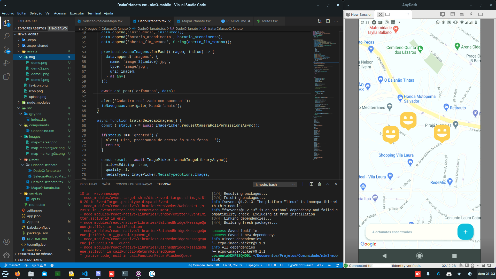

# nlw3-mobile

## 💻 Projeto

Aplicação mobile para marcação de orfanatos em uma mapa com informações para promover visitas e acões de ajuda 💜.
Parte do conteúdo foi disponibilizado no NLW 3, evento realizado pela Rocketseat (https://github.com/Rocketseat).

## Demonstração

<p align="center">
  
</p>

## 🚀 Tecnologias

Esse projeto foi desenvolvido com as seguintes tecnologias:

- [Node.js](https://nodejs.org/en/)
- [React](https://reactjs.org)
- [React Native](https://facebook.github.io/react-native/)
- [Expo](https://expo.io/)
- [TypeScript](https://www.typescriptlang.org/)

## Ambiente (Versões utilizadas)
1. node -v : v12.19.0 (choco upgrade nodejs-lts)
2. npm -v : 6.14.8
3. yarn -v : 1.22.5 (choco upgrade yarn)

## Execução
```sh
cd nlw3-mobile
yarn
yarn global add expo-cli
expo start
```

## Variáveis de ambiente
1. Criar um arquivo .env na raiz do projeto com o token do Mapbox, que é a API de mapas que é utilizada nesse projeto. 

```env
REACT_APP_MAPBOX_TOKEN=[token_mapbox]
``` 

## Roteiro para criação desse projeto
```sh
yarn global add expo-cli
expo init [nome_projeto]
```
## Módulo de mapas (MapView)
```sh
expo install react-native-maps
```
## Instalação de Fontes
```sh
expo install @expo-google-fonts/[nome_fonte] expo-font
```
## Rotas e navegação em pilha (stack)
```sh
yarn add @react-navigation/native
```
```sh
expo install react-native-gesture-handler react-native-reanimated react-native-screens react-native-safe-area-context @react-native-community/masked-view
```
```sh
yarn add @react-navigation/stack
```
1. Criar um arquivo com o nome routes.tsx dentro da pasta src;
2. Criar a pasta pages dentro da pasta src.

## Módulo de requisições (axios)
1. Para realizar requisições entre front-end e back-end pode ser utilizado o fetch() nativo do browser, porém é melhor utilizar o axios porque com ele é possível definir uma baseUrl não sendo necessário informar todo o texto da requisição que é repetida nas diversas chamadas à mesma API.
```sh
yarn add axios
```
2. Criar a pasta services (que pode ser utilizado para qualquer tipo de comunicação com servições externos: banco de dados, API, envio de alguma coisa, indexDb, local storage) dentro da pasta src, e dentro da pasta services criar o arquivo api.ts.
3. Obs.: Se estiver testando a partir de um emulador de Android, rodar o comando abaixo no terminal para que o dispositivo virtual consiga acessar API rodando em localhost.
```sh
adb reverse tcp:3333 tcp:3333
```

## Módulo de Carga de Imagens (expo-image-picker)
```sh
expo install expo-image-picker
```